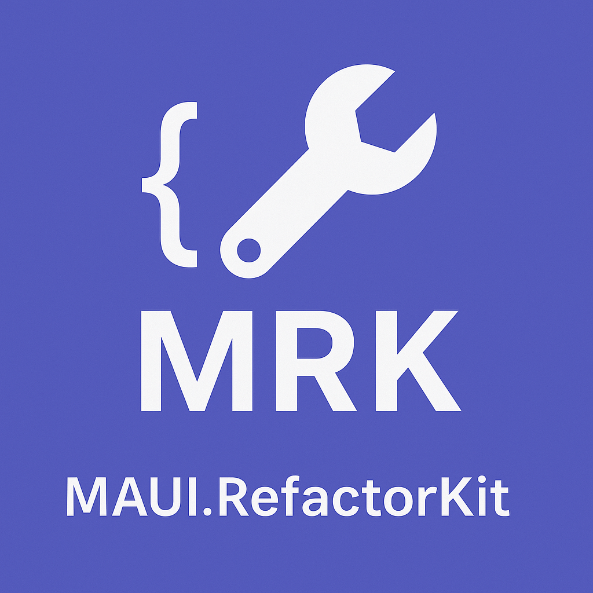

# MAUI.RefactorKit



**MAUI.RefactorKit** is a Roslyn-based analyzer and code fix provider that helps automate the migration from Xamarin.Forms to .NET MAUI by converting legacy property patterns to the new `ObservableProperty` pattern using `CommunityToolkit.Mvvm`.

---

## ✨ Features

- 🔍 Analyzes Xamarin-style properties.
- 🔧 Automatically refactors them into `ObservableProperty` fields (CommunityToolkit.Mvvm).
- 📦 Packaged as a NuGet analyzer — no manual execution required.
- 🧠 Designed for clean, idiomatic .NET MAUI development.

> **Coming Soon**: Refactoring support for `Command` to `RelayCommand`.

---

## 📦 Installation

Add the NuGet package to your MAUI project:

```bash
dotnet add package MAUI.RefactorKit
```
Or via Visual Studio NuGet Manager.

## 🛠 Usage

Simply install the package and build your project.

The analyzer will:

- Detect Xamarin-style backing fields and properties.
- Suggest fixes via lightbulb (Ctrl + .) or auto-fix.
- Transform to the ObservableProperty attribute-based syntax.

### Examples

<details>
    <summary>Properties</summary>

### Before:

```
private string _name;
public string Name
{
    get => _name;
    set
    {
        _name = value;
        OnPropertyChanged(nameof(Name));
    }
}
```

### After:

```
[ObservableProperty]
private string Name;
```

---

### Before:

```
private string _test;
public string Test
{
    get => _test;
    set
    {
        _test = value;
        OnPropertyChanged("CanExecuteCommand");
    }
}
```

### After:

```
[ObservableProperty]
[NotifyPropertyChangedFor(nameof(CanExecuteCommand))]
public partial string Test { get; set; }
```

---

### Before:

```
private string _test1;
public string Test1
{
    get => _test1;
    set
    {
        _test1 = value;
        OnPropertyChanged(nameof(CanExecuteCommand));
    }
}
```

### After:

```
[ObservableProperty]
[NotifyPropertyChangedFor(nameof(CanExecuteCommand))]
public partial string Test1 { get; set; }
```

---

### Before:

```
private bool _canExecuteCommand = false;
public bool CanExecuteCommand
{
    get { return _canExecuteCommand; }
    set { SetProperty(ref _canExecuteCommand, value); }
}
```

### After:

```
ObservableProperty]
public partial bool CanExecuteCommand { get; set; } = false;
```

</details>

## 📌 Requirements

- .NET MAUI project
- CommunityToolkit.Mvvm installed

## 🤝 Contact
If you have any questions, feedback or a bug to report, feel free to open an issue or contact me direct in my mail 😊

# Made with ❤️ to simplify your MAUI migration.